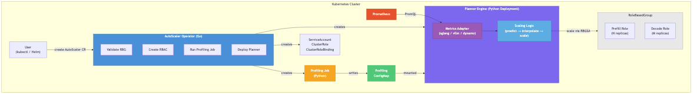
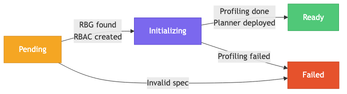
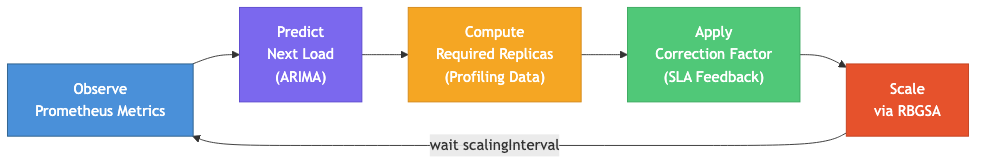

# RBG Planner

An engine-agnostic, framework-independent SLA-driven autoscaler for large model inference on Kubernetes.

RBG Planner works with **any inference engine** (SGLang, vLLM, NVIDIA Dynamo, ...) and **any orchestration framework** (RoleBasedGroup, custom controllers, ...) through its pluggable metrics adapter and connector architecture. It observes real-time latency metrics, predicts future load, and makes proactive scaling decisions to meet TTFT and ITL SLA targets -- all without coupling to a specific inference runtime.

### Key Features

- **Engine-agnostic**: Pluggable Metrics Adapter supports SGLang, vLLM, Dynamo, and any Prometheus-compatible metric source
- **Framework-independent**: Connector interface decouples scaling logic from the orchestration layer
- **SLA-driven**: Scales based on TTFT/ITL latency targets, not just resource utilization
- **Proactive**: ARIMA-based load prediction scales ahead of demand
- **Self-profiling**: Automatic benchmarking generates per-model performance curves for optimal replica calculation
- **PD-disaggregated**: First-class support for Prefill/Decode disaggregated inference patterns

### How It Works

Users create an `AutoScaler` custom resource targeting a [RoleBasedGroup](https://github.com/rolebasedgroup). The operator automatically runs SLA profiling, deploys the planner engine, and continuously scales prefill/decode roles to meet latency targets.

## Acknowledgements

The core planning algorithm, SLA profiling methodology, and performance interpolation approach in this project are derived from [NVIDIA Dynamo](https://github.com/ai-dynamo/dynamo). We are deeply grateful to the Dynamo team for their pioneering work on SLA-driven autoscaling for disaggregated inference. This project adapts and re-implements those ideas to work natively with the Kubernetes RoleBasedGroup API.

## Architecture



### Components

| Component | Image | Description |
|-----------|-------|-------------|
| **AutoScaler Operator** | `rbg-planner-operator` | Go CRD controller. Watches `AutoScaler` CRs, manages the lifecycle: validates the target RBG, creates RBAC, runs profiling Jobs, deploys the planner engine, and updates status. |
| **Planner Engine** | `rbg-planner` | Python SLA-based autoscaler (Dynamo planner algorithm). Observes metrics from Prometheus, predicts load, computes replica requirements from profiling data, and applies scaling decisions via RBGSA. |
| **Profiler** | `rbg-profiler` | Python profiling tool. Runs benchmarks against inference engines and generates profiling data (prefill/decode throughput curves) stored in a ConfigMap. |

### How It Works

1. User creates an `AutoScaler` CR with the same name as the target RBG
2. Operator validates the RBG exists and reads GPU-per-engine from the RBG's resource requests
3. Operator creates a ServiceAccount, ClusterRole, and ClusterRoleBinding for the planner
4. Operator runs a profiling Job to generate performance data (or uses existing ConfigMap)
5. Operator deploys the planner engine as a Deployment with profiling data mounted
6. Planner engine runs in a loop: observe metrics -> predict load -> compute replicas -> scale via RBGSA
7. Operator periodically updates status with current replica counts from the RBG

### Metrics Adapter

The planner uses a pluggable **Metrics Adapter** module to query Prometheus. Each inference engine exposes metrics in a different format -- the adapter normalizes them into a unified interface so the scaling logic is engine-agnostic.

| Adapter | Engine | Differences |
|---------|--------|-------------|
| `SGLangAdapter` | SGLang | ISL/OSL from counter ratios, label `model_name` |
| `VLLMAdapter` | vLLM | ISL/OSL from counter ratios, label `model_name` |
| `DynamoAdapter` | NVIDIA Dynamo | ISL/OSL from histograms, label `model` |
| `PatioAdapter` | Patio | ISL/OSL from counter ratios, label `model_name` |

Configured via `metricsEndpoint.metricSource` in the AutoScaler CR. To add a new engine, implement `MetricsAdapter` in `python/planner/rbg_planner/metrics/` and register it in `ADAPTERS`.

### Lifecycle



### Planner Loop



## Quick Start

### Prerequisites

- Kubernetes cluster with [RBG controller](https://github.com/rolebasedgroup/rbg) installed
- `kubectl` configured to access the cluster
- Prometheus monitoring stack deployed

### Install with Helm

```bash
helm install rbg-planner ./charts/rbg-planner -n rbg-system --create-namespace
```

Override defaults as needed:

```bash
helm install rbg-planner ./charts/rbg-planner -n rbg-system --create-namespace \
  --set image.repository=<your-registry>/rbg-planner-operator \
  --set image.tag=v0.1.0 \
  --set planner.image=<your-registry>/rbg-planner:v0.1.0 \
  --set profiler.image=<your-registry>/rbg-profiler:v0.1.0 \
  --set prometheus.endpoint=http://prometheus.monitoring.svc:9090
```

Key configurable values (`charts/rbg-planner/values.yaml`):

| Value | Default | Description |
|-------|---------|-------------|
| `image.repository` | `ghcr.io/rolebasedgroup/rbg-planner-operator` | Operator image |
| `planner.image` | `ghcr.io/rolebasedgroup/rbg-planner:latest` | Planner image (deployed per CR) |
| `profiler.image` | `ghcr.io/rolebasedgroup/rbg-profiler:latest` | Profiler image (Job per CR) |
| `prometheus.endpoint` | `http://prometheus-kube-prometheus-prometheus.monitoring.svc.cluster.local:9090` | Prometheus URL |
| `leaderElection.enabled` | `true` | Enable leader election for HA |

### Create an AutoScaler

Ensure you have a RoleBasedGroup already deployed (e.g., `sglang-pd-inference`), then create an `AutoScaler` with the **same name**:

```yaml
apiVersion: inference-extension.rolebasedgroup.io/v1alpha1
kind: AutoScaler
metadata:
  name: sglang-pd-inference    # must match the RBG name
  namespace: inference
spec:
  scalingInterval: 180

  pattern:
    PDDisaggregated:
      prefill:
        roleName: prefill
        maxReplicas: 10
        minReplicas: 1
      decode:
        roleName: decode
        maxReplicas: 10
        minReplicas: 1

  implementation:
    DynamoPlanner:
      modelName: "Qwen/Qwen3-0.6B"
      ttft: 200.0
      itl: 20.0
      loadPredictor: arima
      predictionWindow: 50
      noCorrection: false
      dryRun: false

      profiling:
        image: "ghcr.io/rolebasedgroup/rbg-profiler:latest"

      metricsEndpoint:
        metricSource: sglang
        port: 9091
```

```bash
kubectl apply -f config/samples/roleautoscaler_full.yaml
```

### Step 4: Observe

```bash
# Watch the AutoScaler status
kubectl get as -w

# Expected output:
# NAME                  PHASE   PREFILL   DECODE   AGE
# sglang-pd-inference   Ready   1         1        5m

# Watch planner logs
kubectl logs -l app.kubernetes.io/name=rbg-planner -f
```

When load increases, the planner scales up:

```
INFO  Workers: prefill=1, decode=1
INFO  Observed: num_req=1200.00 isl=2048.00 osl=256.00
INFO  Predicted: num_req=1350.00 isl=2100.00 osl=260.00
INFO  Prefill: 15750.00(tok/s) / 2800.00(engine_cap) = 6(replicas)
INFO  Decode: 1950.00(tok/s) / 500.00(engine_cap) = 4(replicas)
INFO  Target replicas: prefill=4, decode=4
INFO  Scaling role prefill: 1 -> 4
INFO  Scaling role decode: 1 -> 4
```

## CRD Reference

### AutoScaler Spec

| Field | Type | Default | Description |
|-------|------|---------|-------------|
| `spec.scalingInterval` | int | `180` | Seconds between scaling decisions |
| `spec.pattern.PDDisaggregated.prefill.roleName` | string | `prefill` | Prefill role name in the RBG |
| `spec.pattern.PDDisaggregated.prefill.minReplicas` | int | `1` | Minimum prefill replicas |
| `spec.pattern.PDDisaggregated.prefill.maxReplicas` | int | (required) | Maximum prefill replicas |
| `spec.pattern.PDDisaggregated.decode.roleName` | string | `decode` | Decode role name in the RBG |
| `spec.pattern.PDDisaggregated.decode.minReplicas` | int | `1` | Minimum decode replicas |
| `spec.pattern.PDDisaggregated.decode.maxReplicas` | int | (required) | Maximum decode replicas |
| `spec.implementation.DynamoPlanner.modelName` | string | (required) | Model name for Prometheus label filtering |
| `spec.implementation.DynamoPlanner.ttft` | float | `500.0` | Target TTFT SLA (ms) |
| `spec.implementation.DynamoPlanner.itl` | float | `50.0` | Target ITL SLA (ms) |
| `spec.implementation.DynamoPlanner.loadPredictor` | string | `arima` | Load predictor: `arima`, `constant`, `prophet` |
| `spec.implementation.DynamoPlanner.predictionWindow` | int | `50` | Data points in predictor window |
| `spec.implementation.DynamoPlanner.noCorrection` | bool | `false` | Disable SLA correction factors |
| `spec.implementation.DynamoPlanner.dryRun` | bool | `false` | Observe only, no actual scaling |
| `spec.implementation.DynamoPlanner.profiling.image` | string | (hardcoded default) | Profiling tool container image |
| `spec.implementation.DynamoPlanner.metricsEndpoint.metricSource` | string | `sglang` | Metric source: `sglang`, `vllm`, `patio` |
| `spec.implementation.DynamoPlanner.metricsEndpoint.port` | int | `9091` | Planner Prometheus metrics port |

### AutoScaler Status

| Field | Description |
|-------|-------------|
| `status.phase` | Current phase: `Pending`, `Initializing`, `Ready`, `Failed` |
| `status.conditions` | Standard Kubernetes conditions |
| `status.prefillReplicas` | Current prefill replica count (from RBG status) |
| `status.decodeReplicas` | Current decode replica count (from RBG status) |
| `status.profilingConfigMap` | Name of the profiling ConfigMap |
| `status.plannerDeployment` | Name of the planner Deployment |

### GPU Budget Calculation

The operator reads GPU-per-engine from the target RBG's `resources.requests["nvidia.com/gpu"]` for each role. The maximum GPU budget is automatically computed as:

```
maxGpuBudget = prefill.maxReplicas * prefillGPUs + decode.maxReplicas * decodeGPUs
```

When the planner's computed replicas exceed this budget, it proportionally scales down both roles while respecting `minReplicas`.

## Prometheus Metrics

The planner engine exposes Prometheus metrics at the configured port (default: `9091`). All metrics are labeled with `namespace` and `rbg_name` for multi-planner filtering.

### Worker Counts & GPU Usage

| Metric | Description |
|--------|-------------|
| `rbg_planner_num_prefill_workers{namespace, rbg_name}` | Current prefill replica count |
| `rbg_planner_num_decode_workers{namespace, rbg_name}` | Current decode replica count |
| `rbg_planner_gpu_hours_total{namespace, rbg_name}` | Cumulative GPU hours used |

### Observed Metrics

| Metric | Description |
|--------|-------------|
| `rbg_planner_observed_ttft_ms{namespace, rbg_name}` | Observed average TTFT (ms) |
| `rbg_planner_observed_itl_ms{namespace, rbg_name}` | Observed average ITL (ms) |
| `rbg_planner_observed_request_rate{namespace, rbg_name}` | Observed request rate (req/s) |
| `rbg_planner_observed_request_duration_seconds{namespace, rbg_name}` | Observed average request duration (s) |
| `rbg_planner_observed_isl{namespace, rbg_name}` | Observed average input sequence length |
| `rbg_planner_observed_osl{namespace, rbg_name}` | Observed average output sequence length |

### Predicted Metrics

| Metric | Description |
|--------|-------------|
| `rbg_planner_predicted_request_rate{namespace, rbg_name}` | Predicted request rate (req/s) |
| `rbg_planner_predicted_isl{namespace, rbg_name}` | Predicted input sequence length |
| `rbg_planner_predicted_osl{namespace, rbg_name}` | Predicted output sequence length |
| `rbg_planner_predicted_num_prefill{namespace, rbg_name}` | Predicted prefill replicas needed |
| `rbg_planner_predicted_num_decode{namespace, rbg_name}` | Predicted decode replicas needed |

### Correction Factors

| Metric | Description |
|--------|-------------|
| `rbg_planner_p_correction_factor{namespace, rbg_name}` | Prefill correction factor (observed / expected TTFT) |
| `rbg_planner_d_correction_factor{namespace, rbg_name}` | Decode correction factor (observed / expected ITL) |

## Grafana Dashboard

A pre-built Grafana dashboard is provided at `deploy/grafana-planner-dashboard.yaml` with four sections:

1. **Worker Counts & GPU Usage** -- Stat panels + history timeseries
2. **Observed Metrics** -- TTFT/ITL latency, request rate/duration, ISL/OSL
3. **Predicted Metrics** -- Predicted request rate, sequence lengths, replica counts
4. **Correction Factors** -- Gauge panels with threshold coloring + history

The dashboard includes **Namespace** and **RBG Name** dropdown variables for filtering when running multiple planners.

```bash
kubectl apply -f deploy/grafana-planner-dashboard.yaml
```

## Project Structure

```
rbg-planner/
├── api/v1alpha1/                  # CRD type definitions (AutoScaler CRD)
├── cmd/main.go                    # Operator entrypoint
├── internal/controller/           # Reconciler implementation
├── config/
│   ├── crd/                       # Generated CRD manifests
│   ├── rbac/                      # Generated RBAC manifests
│   └── samples/                   # Example AutoScaler CR
├── python/
│   ├── planner/                   # Planner engine (Python)
│   │   ├── rbg_planner/           # Core planner package
│   │   │   └── metrics/           # Pluggable metrics adapters
│   │   ├── tests/                 # Planner tests
│   │   ├── Dockerfile             # Planner image
│   │   └── pyproject.toml
│   └── profiler/                  # Profiling tool (Python)
│       ├── rbg_profiler/          # Core profiler package
│       ├── Dockerfile             # Profiler image
│       └── pyproject.toml
├── charts/rbg-planner/            # Helm chart for operator deployment
├── docs/                          # Architecture and flow diagrams
├── deploy/                        # Grafana dashboard
├── Dockerfile                     # Operator image (Go)
├── Makefile                       # Build targets
└── go.mod
```

## Development

```bash
# Generate deepcopy methods
make generate

# Generate CRD and RBAC manifests
make manifests

# Build operator binary
make build

# Run operator locally (outside cluster)
make run

# Run Go tests
make test

# Run Python planner tests
make test-python

# Build all Docker images
make docker-build-all
```

### Docker Images

| Image | Dockerfile | Description |
|-------|-----------|-------------|
| `rbg-planner-operator` | `Dockerfile` | Go operator controller |
| `rbg-planner` | `python/planner/Dockerfile` | Python planner engine |
| `rbg-profiler` | `python/profiler/Dockerfile` | Python profiling tool |

```bash
# Build individually
make docker-build           # operator
make docker-build-planner   # planner
make docker-build-profiler  # profiler

# Build all
make docker-build-all
```

## License

Apache-2.0
